<h1 align="center">WW-DHSVM</h1>

<p align="center">
  <b>Give it a HUC code. Get back a running hydrologic model.</b><br>
  <sub>Watershed Workflow, retargeted from ATS to DHSVM.</sub>
</p>

<p align="center">
  
  
  
</p>

<p align="center">
  <sub>by <a href="https://github.com/ZhiLiHydro">Zhi Li</a> ·
  University of Connecticut ·
  <a href="https://github.com/UConn-EFC">UConn-EFC</a></sub>
</p>

<p align="center">
  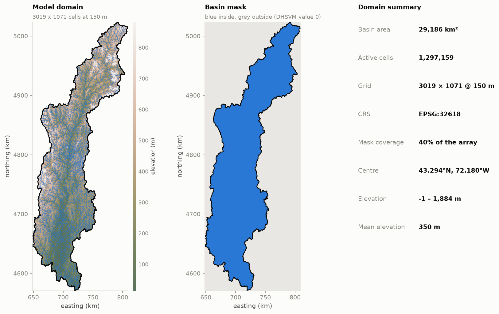
</p>

Setting up a distributed hydrologic model usually costs a week: a dozen
downloads in a dozen projections, a GIS session that is hard to repeat,
and a binary file format that fails silently if you get a byte wrong.
WW-DHSVM does that part for you.

```python
watershed = ww_dhsvm.getWatershed('0108')        # any USGS HUC code
grid      = ModelGrid.fromShape(watershed, cellsize=150)
```

Two lines in, you have a model domain. Everything after that — every
input the [Distributed Hydrology Soil Vegetation
Model](https://dhsvm.pnnl.gov/) needs, pulled from public sources,
harmonised onto one grid, checked, and written in DHSVM's own binary and
ASCII formats — is in
[the notebook](notebooks/connecticut_river_basin_dhsvm.ipynb), with the
reasoning left in rather than tidied away.

Point it at a **HUC code** of any even length from 2 to 12 digits, or at
your own shapefile, and you get a complete, runnable case. The
[worked example](#the-worked-example-the-connecticut-river-basin) below is
the entire Connecticut River Basin, but nothing in the workflow is
specific to it.

---

## Contents

- [The 60-second version](#the-60-second-version)
- [Where this came from](#where-this-came-from-forking-watershed-workflow)
- [DHSVM and ATS](#dhsvm-and-ats-the-same-physics-two-discretisations)
- [What DHSVM actually reads](#what-dhsvm-actually-reads)
- [Try it](#try-it)
- [The worked example: the Connecticut River Basin](#the-worked-example-the-connecticut-river-basin)
- [How well does it parallelise?](#how-well-does-it-parallelise)
- [Building DHSVM](#building-dhsvm)
- [Layout, testing, attribution](#layout)

---

## The 60-second version

| | |
|---|---|
| **Input** | a HUC code, or a shapefile |
| **Output** | a complete DHSVM case: 5 binary maps, 3 stream files, N forcing files, 4 state files, 1 config |
| **Demo basin** | Connecticut River, 29,186 km², 3019 × 1071 cells at 150 m |
| **Channel network** | 23,790 segments, 25,197 km, derived from the conditioned DEM |
| **Forcing** | AORC (default), Daymet, or **NOAA HRRR** via Herbie |
| **Runtime** | 23 min for a full year on 8 MPI ranks |
| **Water balance** | closes to **1.2 × 10⁻⁴ mm** |

---

## Where this came from: forking Watershed Workflow

WW-DHSVM is a fork of
[Watershed Workflow](https://github.com/environmental-modeling-workflows/watershed-workflow)
v2.1.0 (BSD), the toolset the ATS community uses. Its central idea is
worth stating plainly, because it is the thing this fork inherits and is
built around:

> A hyper-resolution model setup should be reproducible from **a HUC code
> or a watershed polygon**. Every data choice belongs in a declarative
> *source manager*, not in a sequence of manual GIS steps nobody can
> repeat.

**Kept** — the source-manager architecture (CRS normalisation, bounding-box
buffering and snapping, an on-disk cache with *superset detection* so a
second run re-downloads nothing), all eighteen inherited data-source
implementations, and the CRS/warp/colour infrastructure.

**Removed** — everything specific to ATS's unstructured discretisation,
because DHSVM runs on one regular grid and none of it has an analogue:
2D/3D mesh generation, Delaunay triangulation, stream-aligned river
meshing, mesh extrusion, ExodusII and VTK writers, labeled-set regions,
the river-tree structure, and the ATS XML input-spec writers.

**Added** — the DHSVM half:

| module | role |
|---|---|
| `grid.py` | the regular model grid — the analogue of WW's `mesh.py` |
| `binary.py` | DHSVM's headerless binary maps, dtypes from `VarID.c` |
| `terrain.py` | resampling, gap filling, stream burning, depression filling, D8 routing, Horn slope/aspect, terrain-index soil depth |
| `streams.py` | channel delineation, segment topology, routing rank, the three stream files, impervious routing |
| `soils.py` | USDA texture classification, Brooks–Corey parameter blocks |
| `vegetation.py` | NLCD → DHSVM two-layer canopy crosswalk |
| `states.py` | the four initial model-state files |
| `meteorology.py` | AORC / Daymet / **HRRR** → DHSVM station forcing |
| `sources/manager_hrrr.py` | **new** — NOAA HRRR via [Herbie](https://github.com/blaylockbk/Herbie) |
| `config_writer.py` | the DHSVM configuration file, with cross-checks |
| `diagnostics.py` | structural, physical and descriptive input QA |
| `output.py` | readers for DHSVM's output files |
| `figures.py` / `plot.py` | every figure in this README |
| `workflow.py` | staged orchestration |

---

## DHSVM and ATS: the same physics, two discretisations

If you have arrived from the ATS side of the fence, here is the map:

| | **DHSVM** | **ATS** |
|---|---|---|
| Discretisation | one regular, north-up, square grid | unstructured stream-aligned mixed-polyhedral mesh |
| Subsurface | quasi-3D: 1D vertical unsaturated + 2D saturated lateral, transmissivity decaying exponentially with depth | fully 3D variably-saturated Richards |
| Surface | explicit D4/D8 cell routing + a 1D channel network | diffusion-wave overland flow |
| Canopy | explicit **two-layer** overstory/understory energy balance | single-layer canopy |
| Snow | two-layer mass/energy balance with canopy interception and unloading | multi-layer snowpack |
| Soil hydraulics | **Brooks–Corey** (λ, air-entry ψ_b) | **van Genuchten** (α, n) |
| Time stepping | fixed, typically 1–3 h | adaptive |
| Inputs | binary maps + ASCII tables + INI config | ExodusII mesh + HDF5 + XML |
| Parallelism | Global Arrays + MPI | MPI throughout |
| Language | C | C++ (Amanzi/Arcos) |

The two overlap almost perfectly in **data acquisition** — which is why
Watershed Workflow's source layer transferred wholesale — and diverge in
essentially everything downstream. ATS asks *"what mesh?"*; DHSVM asks
*"what grid, and what are the 19 soil and 35 vegetation parameters on
it?"*

---

## What DHSVM actually reads

Nine kinds of file. WW-DHSVM writes all of them, and this section exists
so that you can check its homework.

**1. The configuration** — INI-style sections `[OPTIONS] [AREA] [TIME]
[CONSTANTS] [TERRAIN] [ROUTING] [METEOROLOGY] [SOILS] [VEGETATION]
[OUTPUT]`. Forgiving about whitespace and ordering, and completely
unforgiving about a key being absent when an option requires it.

**2–6. Five binary maps** — headerless streams of values in row-major
order from the **north-west** corner. There is no metadata in the file at
all: the shape comes from `[AREA]`, and the dtype from a compiled-in
table in `VarID.c`.

| map | quantity | dtype |
|---|---|---|
| `dem.bin` | elevation (m) | `float32` |
| `mask.bin` | basin mask | `uint8` |
| `soil.bin` | soil class `1..N` | `uint8` |
| `soild.bin` | soil depth (m) | `float32` |
| `veg.bin` | vegetation class `1..N` | `uint8` |

**7–9. Three stream files** that must agree with each other exactly:

```
stream.class.dat     ID  width  depth  manning_n  infiltration
stream.network.dat   ID  order  slope  length  class  outlet_ID  [SAVE "name"]
stream.map.dat       col row  seg_ID  length  cut_height  cut_width  aspect
```

`col` and `row` are **zero-based**, and row 0 is the northernmost. Note
that `order` is DHSVM's *routing rank* — `1 + max(upstream)` — and not
Strahler order; `streams.py` computes both and keeps them separate.

**Plus** one forcing file per station:

```
MM/DD/YYYY-HH   Tair[°C]   Wind[m/s]   RH[%]   Sin[W/m²]   Lin[W/m²]   Precip[m per timestep]
```

Temperature in **Celsius**, and precipitation as a **depth accumulated
over one timestep** — not a rate. Then four initial-state files, and —
whenever any vegetation type is partly impervious — an impervious-surface
routing file.

---

## Try it

```bash
conda env create -f environment.yml
conda activate ww-dhsvm
```

Fetch the demo basin's data. It is about 7 GB and it is cached, so you
pay for it once — skip this entirely if `demo/cache_ct/` is already
populated:

```bash
export WWD_HUC=0108 WWD_CACHE=$PWD/demo/cache_ct
python demo/fetch_static.py       # DEM, land cover, impervious
python demo/fetch_soil_nhd.py     # POLARIS texture, NHD flowlines
python demo/fetch_aorc_2025.py    # AORC meteorology
```

Then build it, run it, look at it:

```bash
python demo/build_demo.py            # -> demo/ConnecticutRiverBasin/
python demo/run_dhsvm.py             # 8 MPI ranks
python demo/make_figures.py          # the input figures
python demo/plot_written_inputs.py   # the .bin files, read back off disk
```

Optional, if you want the HRRR comparison too (Herbie will fetch ~2 GB of
GRIB):

```bash
python demo/fetch_hrrr_june.py
python demo/make_hrrr_comparison.py
```

Or — better — open
[the notebook](notebooks/connecticut_river_basin_dhsvm.ipynb), which does
all of the above with the reasoning attached and a diagnostic after every
stage.

**To model a different basin, change one string:**

```python
HUC = '0108'          # -> any even-length HUC, 2 to 12 digits
# SHAPEFILE = '...'   # -> or your own polygon
```

Everything downstream — grid, terrain, network, soils, vegetation,
forcing, states, config — follows from that one line.

---

## The worked example: the Connecticut River Basin

New England's largest river system — HUC4 `0108`, 29,186 km² from the
Canadian border to Long Island Sound, on a 150 m grid with **1.3 million
active cells**, driven by a full year of 2025 meteorology. It builds in
about half a minute and runs in twenty-three.

Every figure below came out of the notebook, from this case, with no
retouching. They are here because a model input you have not looked at is
a model input you do not know.

### The land, and how water moves across it

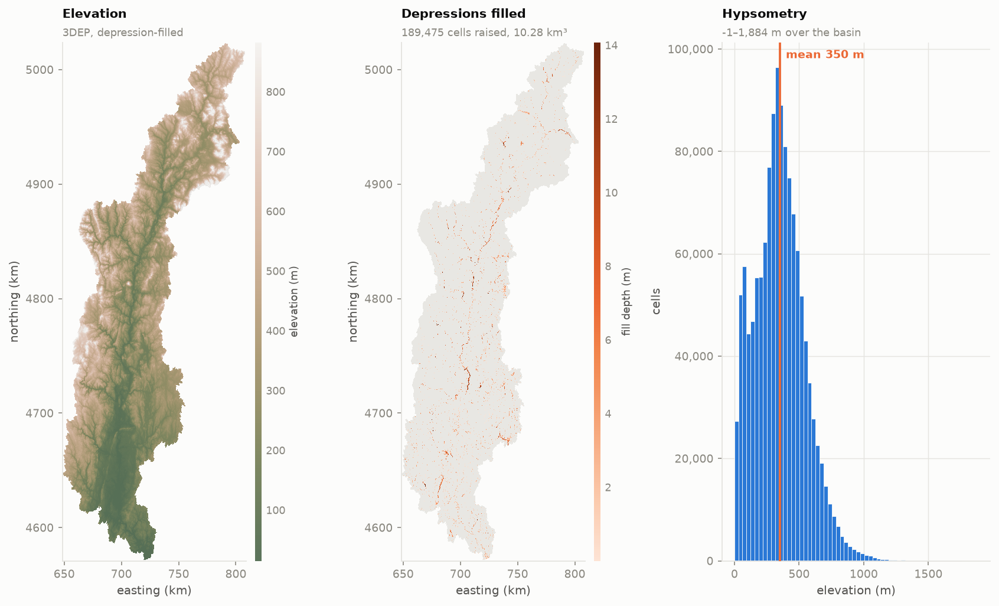

Depression filling is not cosmetic housekeeping. A sink left in the DEM
becomes a permanent lake; a flat becomes a place where the routing
gradient is zero and the water simply stops.

Flow accumulation runs on the DEM *masked to the basin*, not on the
buffered raster it was fetched with. Skip that step and every out-of-basin
cell draining towards you inflates the main stem — here it was 35,127 km²
of contributing area on a 29,186 km² basin, a fifth of it arriving from
over the divide, with channel widths sized to match. Confined, the maximum
comes to 29,145 km²: 99.9% of the basin, the rest being cells the D8
network sends to a neighbouring outlet.

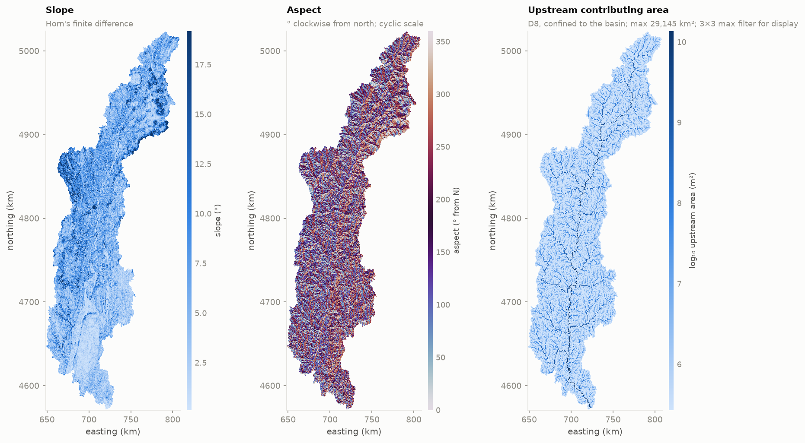

### The channel network

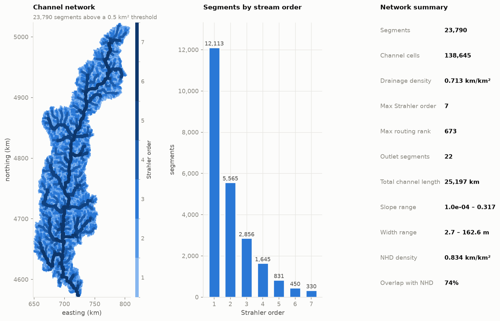

These channels are delineated from D8 flow directions on the conditioned
DEM rather than traced from NHD geometry, because DHSVM needs channels
that live where water actually flows on *its* grid, not where a
cartographer drew them on someone else's. NHD still earns its keep twice:
it burns the DEM, and it grades the answer. Drainage density comes out at
0.713 km/km² against NHD's 0.834, with 74% of derived channel cells
landing within one cell of a mapped reach.

Two things the build reports that are worth understanding:

**Channel classes are derived from this basin, not from a fixed table.**
The area bands in PNNL's `channelclass.py` stop at 40 km², which is right
for the ~500 km² Chiwawa they were written for; applied here they would
put everything from 40 km² to the 29,145 km² outlet into one class, with
one width and one depth. `classifyChannels` instead log-spaces the bands
over the basin's own area distribution: six bands from 3.2 to 4,710 km²,
widths of 2.7 – 162.6 m, depths of 0.29 – 4.49 m, crossed with three
roughness groups for 18 classes. Widths are then capped so no cell claims
more channel area than it has area — a 150 m grid holds about 112 m of
width, and the cap binds on 2,598 of 138,645 channel cells.

**The network has 22 outlets, not one.** Benign here: one drains 29,145
km², the other 21 drain 31.5 km² between them, or 0.11% of the basin.
They are slivers along the divide where a flow path leaves the mask
directly instead of joining the main network. On a headwater catchment,
though, 22 outlets would mean the delineation is broken — which is why
the warning stays.

### Soils and vegetation

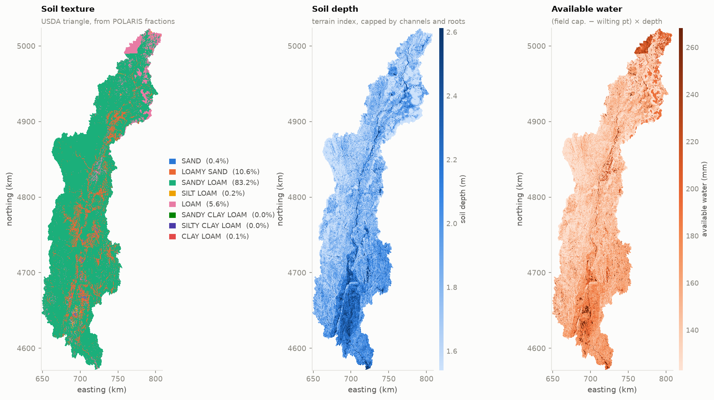
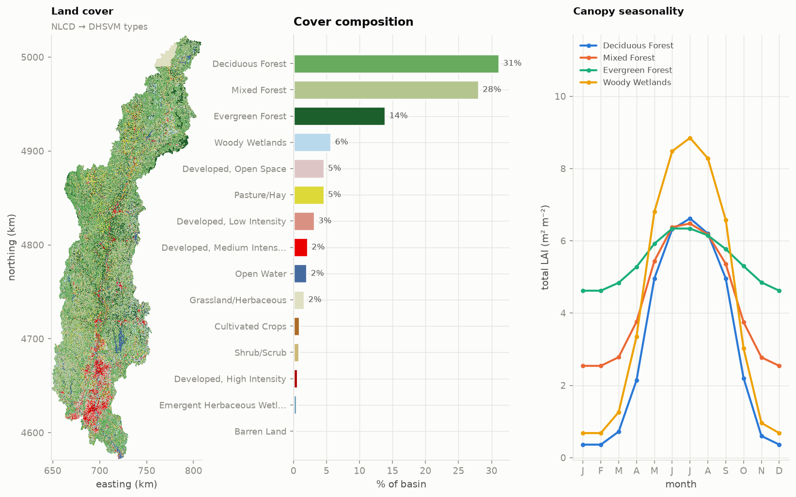

DHSVM's canopy is a full **two-layer** energy balance, which is why its
vegetation block runs to ~35 keys per type, and why the seasonality panel
earns its place: deciduous overstory LAI swings from 0.2 to 5.5 while
evergreen sits at 4.5–5.5 all year, and that contrast drives most of the
seasonal ET signal. (The panel plots overstory + understory together, so
its curves run a little higher.)

### The weather

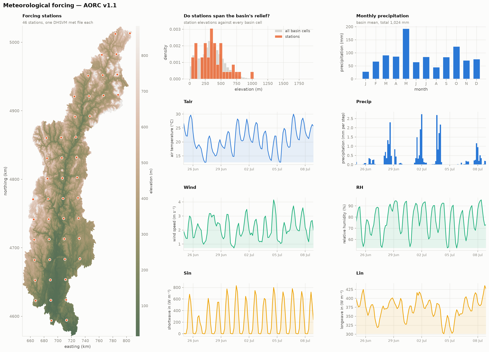

DHSVM interpolates forcing from *every* station at *every* timestep, so
one missing value propagates across the whole basin immediately. AORC
v1.1 has isolated gaps — five of these 46 stations each carry two —
so `writeStationFile` interpolates short gaps, logs every fill, and
refuses anything longer than eight timesteps.

### Two forcing products, cross-checked

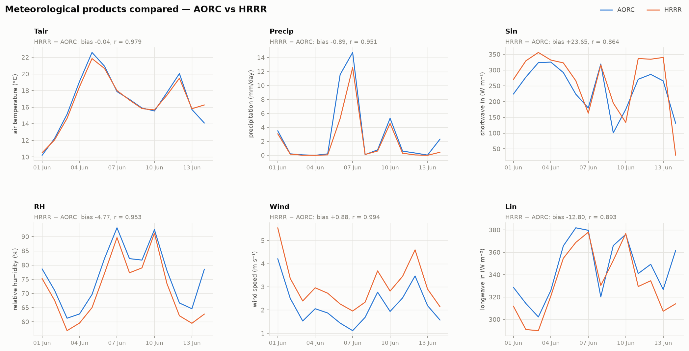

The HRRR manager is the one new data source in this fork, and it is
fussier than it looks. Each valid hour is assembled from the run
initialised an hour *earlier*, at forecast hour 1 — because accumulated
precipitation does not exist in the analysis at all, and the radiation
fluxes are period averages rather than instantaneous values.

Comparing two independent products over the same basin is the cheapest
check on forcing quality there is. Over 1–14 June 2025:

| | AORC | HRRR | HRRR − AORC | r |
|---|---|---|---|---|
| air temperature (°C) | 16.72 | 16.68 | **−0.04** | 0.979 |
| precipitation (mm/day) | 2.84 | 1.95 | **−0.90** | 0.951 |
| shortwave in (W/m²) | 242.5 | 266.2 | +23.7 | 0.864 |
| longwave in (W/m²) | 345.7 | 332.9 | −12.8 | 0.893 |
| relative humidity (%) | 75.9 | 71.2 | −4.8 | 0.953 |
| wind speed (m/s) | 2.20 | 3.08 | **+0.88** | 0.994 |

Correlations of 0.86–0.99 between two entirely independent products is
reassuring for both. The disagreements are the documented ones: HRRR runs
windier and **31% drier on convective June rainfall**. Its precipitation
is a short-range forecast field, so it places convection imperfectly even
when it nails the timing.

For an annual water balance that precipitation gap is the one that bites,
which is why this demo is driven by AORC. For a storm study at 3 km and
hourly resolution, HRRR is the better instrument:

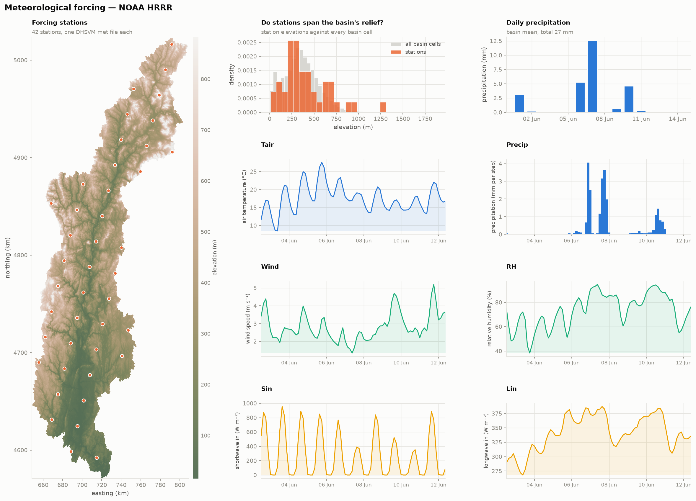

### The files DHSVM will actually read

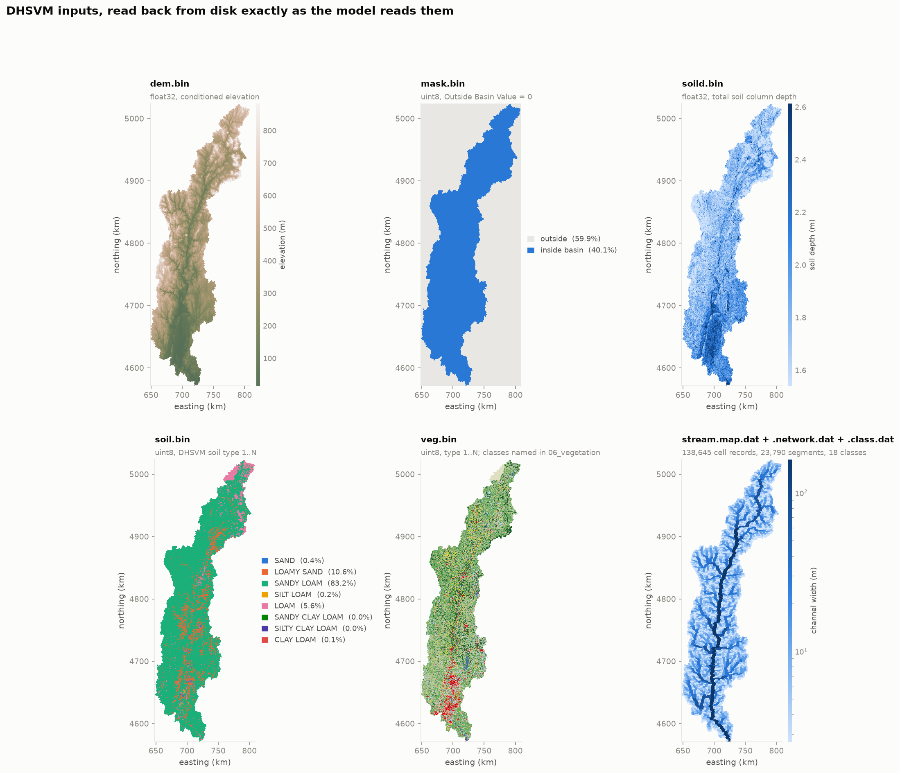

Read back off disk with the same dtype table DHSVM compiles in — so what
you are looking at is, byte for byte, what the model is about to see.

### Is it ready to run?

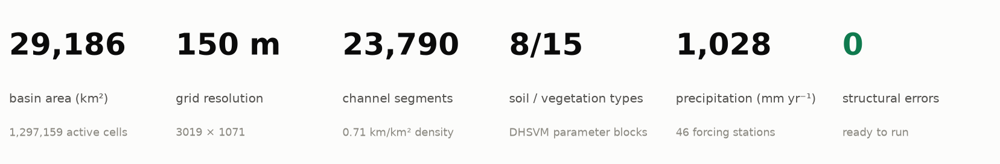

### And then it runs

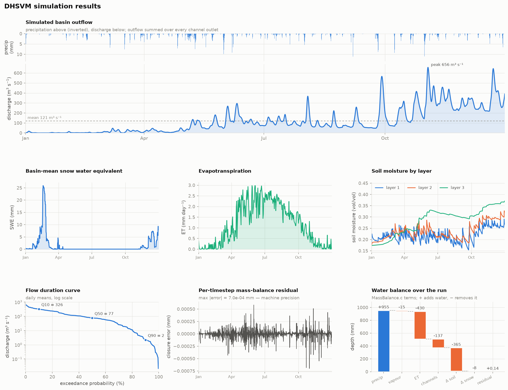

Calendar year 2025, 3-hourly, 2,913 timesteps, 8 MPI ranks, 23 minutes:

| | mm | note |
|---|---|---|
| precipitation | 954.8 | basin mean, as DHSVM interpolated it from 46 stations |
| evapotranspiration | 429.9 | 45% of precipitation |
| vapour flux from snow | −14.9 | sublimation from pack and canopy |
| to the channel network | 136.6 | `ChannelInt`, what leaves the hillslopes |
| routed outflow | 130.0 | mean 121 m³ s⁻¹, peak 656 m³ s⁻¹ |
| Δ soil water | +365.2 | **the model is still wetting up** |
| Δ snowpack | +8.1 | |
| closure error | 1.2 × 10⁻⁴ | DHSVM's own `MassBalance.c` residual |

One number needs explaining: **+365 mm into soil storage**. This run
starts from a uniform initial state with no spin-up — one year of
forcing, one year of simulation — so a third of the year's rain spends
itself filling a soil column that began too dry, and the hydrograph is
correspondingly low: 121 m³ s⁻¹ mean against the 450–560 m³ s⁻¹ the USGS
gauges on the lower main stem see in an average year.

At equilibrium the same forcing implies `P − ET = 525 mm`, which over
29,186 km² is **486 m³ s⁻¹** — squarely inside the observed range. So the
*fluxes* are right and the *storage* has not converged yet. Two or three
years of spin-up ahead of the analysis year is the fix, and the pieces
are already here: `writeConfig(state_dates=[...])` makes DHSVM dump a
full model state on any date you choose, and the next run's `Initial
State Directory` reads it straight back. It is left out of the demo on
purpose — one year is what fits in a notebook you can sit and run.

---

## How well does it parallelise?

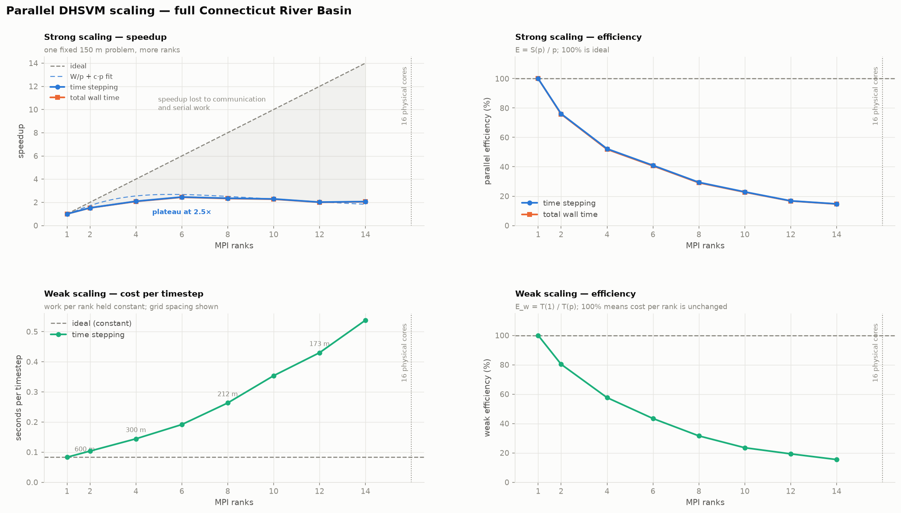

Both experiments run the full Connecticut basin on the Global-Arrays
parallel build, on a 16-physical-core machine, swept to 90% of them.

**Strong scaling** holds the 150 m problem fixed (1.30 M active cells) and
adds ranks. **Weak scaling** holds the work *per rank* constant: DHSVM's
cost is dominated by per-cell work and cell count goes as `1/cellsize²`,
so the grid spacing is set to `cellsize(p) = 600 m / √p` — and every point
is an **independently built case** at its own resolution, not a resampled
copy of one case.

Two measurement notes, because they change the answer:

- DHSVM's own `Runtime Summary` uses `clock()`, which is **CPU time** and
  counts MPI busy-waiting. It is useless for scaling. Wall time is
  measured externally.
- A raw wall time mixes a largely serial initialization — reading maps,
  building a 23,790-segment channel network, computing interpolation
  weights — with the parallel stepping loop. Each configuration is
  therefore run **twice**, at 8 and 240 timesteps, and differenced:

  ```
  T_step = (T_long − T_short) / (N_long − N_short)
  T_init =  T_short − N_short × T_step
  ```

  That isolates the part that actually parallelizes. The initialization
  term is itself the Amdahl serial fraction that bounds achievable
  speedup, so it is plotted rather than hidden.

### What the sweep measured

| ranks | strong: s/step | speedup | eff. | | weak: grid | s/step | eff. |
|---|---|---|---|---|---|---|---|
| 1 | 1.249 | 1.00 | 100% | | 760×273 | 0.083 | 100% |
| 2 | 0.820 | 1.52 | 76% | | 1071×383 | 0.103 | 80% |
| 4 | 0.597 | 2.09 | 52% | | 1513×539 | 0.144 | 58% |
| **6** | **0.508** | **2.46** | 41% | | 1852×658 | 0.192 | 43% |
| 8 | 0.531 | 2.35 | 29% | | 2136×759 | 0.263 | 32% |
| 10 | 0.545 | 2.29 | 23% | | 2388×848 | 0.354 | 23% |
| 12 | 0.619 | 2.02 | 17% | | 2615×928 | 0.430 | 19% |
| 14 | 0.605 | 2.06 | 15% | | 2824×1002 | 0.538 | 15% |

Speedup **peaks at 6 ranks (2.5×)** and then flattens. Weak efficiency
falls steadily even though the weak design is tight — active cells per
rank are constant to four significant figures (81,060 to 81,073).

### Why — and one hypothesis the data killed

The obvious suspect was DHSVM's channel routing: `channel_route_network`
sweeps routing rank 1, 2, 3 … in order, and each sweep depends on the one
before, so its serial depth is the routing rank — which grows from 177 to
~900 as the weak-scaling grid refines. A tempting story.

**The data rejects it.** Across the weak series, step time correlates
with routing rank at only *r* = 0.67, against *r* = 0.99 for rank count
itself, and in a joint fit `step ~ p + rank` the rank term takes the
*wrong sign* (−1.4 × 10⁻⁴ s per unit of rank). Segments per rank is
roughly constant (2,006 → 1,660), so channel work per rank is not what is
growing.

What does fit is the simplest two-term model there is — fixed work split
`p` ways, plus an overhead paid once per rank per timestep:

$$T(p) = \frac{W}{p} + c\,p$$

| | W (s) | c (ms/rank) | R² |
|---|---|---|---|
| strong | 1.285 | **42.1** | 0.918 |
| weak | 0.044 | **35.7** | 0.983 |

Two independently designed experiments recover the **same overhead
coefficient** to within 15%, which is what makes this more than
curve-fitting. And the model predicts the strong-scaling optimum at
`p = √(W/c) = 5.5` — the sweep measured its minimum at **p = 6**.

So the bottleneck is per-timestep communication and synchronisation
growing linearly with rank count, not the channel network.

### The caveat that matters

This is one laptop-class node — an i9-13950HX under WSL2, with all ranks
sharing one memory controller, and a hybrid core layout that WSL2 does
not expose faithfully enough to attribute the plateau to P- versus
E-cores. It is **not** a cluster measurement.
[Perkins et al. (2019)](https://doi.org/10.1016/j.envsoft.2019.104533)
report considerably better scaling for parallel DHSVM on HPC hardware,
and nothing here contradicts that. The practical lesson for a workstation
is narrower and still useful: **for a basin this size, about 6 ranks is
where the returns stop**, and `√(W/c)` will tell you where that lands on
your own machine.

Reproduce with `python demo/scaling.py && python demo/plot_scaling.py`.

---

## Building DHSVM

DHSVM is **not** vendored here — get it from
[pnnl/DHSVM-PNNL](https://github.com/pnnl/DHSVM-PNNL) and build it
yourself. Two branches matter: `master` (serial, v3.2) and `parallel`
(Global Arrays + MPI,
[Perkins et al., 2019](https://doi.org/10.1016/j.envsoft.2019.104533)).

```bash
git clone https://github.com/pnnl/DHSVM-PNNL.git
cd DHSVM-PNNL

# serial
cmake -D CMAKE_BUILD_TYPE=Release -D DHSVM_USE_X11=OFF -D DHSVM_USE_NETCDF=OFF \
      -D CMAKE_C_FLAGS="-O2 -w -std=gnu17 -Wno-implicit-function-declaration" ..
cmake --build . -j8
```

For the parallel branch you also need
[Global Arrays](https://github.com/GlobalArrays/ga) (5.8.2 works) built
against MPI, then:

```bash
git checkout parallel
patch -p1 < /path/to/ww_dhsvm/patches/dhsvm-parallel-epot-fix.patch   # <-- apply this
cmake -D CMAKE_BUILD_TYPE=Release -D GA_DIR=<ga-install> \
      -D CMAKE_C_COMPILER=mpicc -D CMAKE_EXE_LINKER_FLAGS="-lm" ..
cmake --build . -j8
mpirun -np 8 ./DHSVM/sourcecode/DHSVM INPUT.ConnecticutRiverBasin
```

**Do apply the patch.** The `parallel` branch last synced with `master`
on 2020-09-11, and `master` ran on to 2022-07-21; the one net source
difference is a unit bug in `Aggregate.c` that serial fixed in 2021 and
parallel never received. Converting a rate in m/s to a depth over the
timestep requires *multiplying* by `Dt`, and both branches divided — an
error of `Dt²`, about 10⁸ at a 3 h timestep. It is diagnostic-only
(`MassBalance.c` uses actual ET, not potential) but it corrupts every
`PotTransp.*` column: before the fix, the constraint EPot ≥ EAct was
violated in 46 of 114 timesteps; after, it holds in all of them. Every
result in this README comes from a patched build. The fix is shipped as
[`patches/dhsvm-parallel-epot-fix.patch`](patches/dhsvm-parallel-epot-fix.patch).

Two notes for modern toolchains: DHSVM 3.2 and Global Arrays 5.8.2 are
both pre-C99 in places, so a recent GCC needs `-std=gnu17` and the
implicit-declaration warnings demoted; and `Flow Routing =
UNIT_HYDROGRAPH` is not implemented in the parallel branch.

---

## Layout

```
ww_dhsvm/                   the package — 28 modules
  sources/                  data-source managers (inherited from WW, plus HRRR)
  data/                     soil, vegetation and channel tables (edit these)
notebooks/
  connecticut_river_basin_dhsvm.ipynb   the worked example
demo/
  fetch_*.py                download and grid the source data
  build_demo.py             assemble the DHSVM case
  run_dhsvm.py              run it and read the output
  plot_written_inputs.py    read the .bin files back off disk and plot them
  make_hrrr_comparison.py   AORC vs HRRR over the same basin
  scaling.py                the strong/weak sweep
  plot_scaling.py           and its figure
  cleanup_for_release.py    what produced the tree you are reading
  figures/                  every figure in this README
  scaling/results.json      the measured sweep
patches/                    the DHSVM parallel-branch bug fix
tests/                      36 format tests + an end-to-end test that runs DHSVM
CITATION.cff                how to cite this
AUTHORS                     who wrote what, and what is inherited
LICENSE                     MIT, with a note on the inherited BSD portions
```

**Not tracked, and regenerated on demand:** `/data/` at the repository
root (the source-manager download cache — *not* `ww_dhsvm/data/`, which
is package data and is tracked), `demo/cache_ct/*.npy` (the basin's
gridded inputs, ~92 MB), and `demo/ConnecticutRiverBasin/` (the built
case and its output).

Those caches are what make the second run fast. A clean clone re-downloads
them with the three `fetch_*.py` scripts above; nothing else is needed.

## Testing

```bash
python -m pytest tests/test_formats.py -v      # 36 conventions DHSVM does not check
python tests/test_end_to_end_synthetic.py      # builds a synthetic basin and RUNS DHSVM
```

`test_formats.py` checks binary dtypes, state-matrix stacking, grid
origin, zero-based stream indices, metres-per-timestep precipitation, the
USDA texture triangle, routing-cycle rejection, forcing-gap repair and the
channel-area cap. Five of the 36 validate against **DHSVM's own Chiwawa
test case** — its file sizes, its state-matrix counts, its elevation range
— rather than against this package's expectations of itself; those skip
cleanly if you haven't checked DHSVM out.

`test_end_to_end_synthetic.py` builds a complete synthetic basin, writes
every input, and runs the real DHSVM binary on it. It is the fastest way
to catch a format error, because DHSVM validates far more of its input
than any Python-side check can. Point it at your build:

```bash
DHSVM_EXE=/path/to/DHSVM python tests/test_end_to_end_synthetic.py
```

Without a binary it still writes and checks every input, then says so and
exits cleanly.

## Attribution

WW-DHSVM is written and maintained by
[Zhi Li](https://github.com/ZhiLiHydro) at the University of Connecticut.
If it is useful to you, please cite it — [`CITATION.cff`](CITATION.cff)
has the metadata, and GitHub will format it for you from the *Cite this
repository* button. [`AUTHORS`](AUTHORS) records which parts of this
repository are inherited work rather than ours.

Please cite what it stands on, too:

Watershed Workflow (BSD) — Coon, E. T., & Shuai, P. (2022). *Watershed
Workflow: A toolset for parameterizing data-intensive, integrated
hydrologic models.* Environmental Modelling & Software, 157, 105502.

DHSVM — Wigmosta, M. S., Vail, L. W., & Lettenmaier, D. P. (1994). *A
distributed hydrology-vegetation model for complex terrain.* Water
Resources Research, 30(6), 1665–1679.

Parallel DHSVM — Perkins, W. A., et al. (2019). Environmental Modelling &
Software, 122, 104533.

Data: USGS WBD, NHDPlus and 3DEP; MRLC NLCD; POLARIS; NOAA AORC and HRRR.
No model executable or third-party dataset is redistributed here — please
observe each product's licence and citation requirements.

WW-DHSVM's own code is released under the **MIT** licence
([`LICENSE`](LICENSE)). The portions inherited from Watershed Workflow
remain under its 3-clause BSD licence, kept verbatim in
[`LICENSE.watershed-workflow`](LICENSE.watershed-workflow); both are
permissive, and the practical upshot is that you may use and redistribute
all of this freely so long as you keep both notices.
